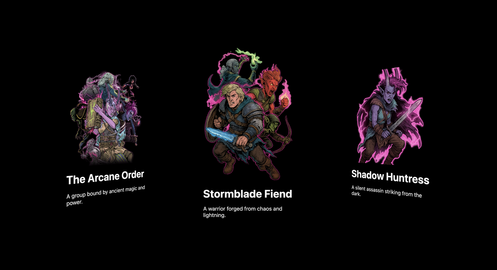

## 🎴 Animated Fantasy Cards

A visually stunning set of 3D animated fantasy character cards built using HTML, SCSS, and JavaScript. Each card features a unique magic-themed character, rotating conic-gradient borders, perspective tilt, hover glow effects, and clean fantasy styling. Smooth animations and vibrant colors bring the cards to life.

## 🌐 Live Demo
https://dev-hamza03.github.io/animated-fantasy-cards/

## 📁 GitHub Repository
https://github.com/dev-hamza03/animated-fantasy-cards

## ✨ Features
- 3D perspective card tilt
- Animated conic-gradient borders
- Unique glow colors per card
- Smooth hover transitions
- High-quality fantasy artwork
- Clean and responsive layout
- Pure HTML, SCSS, and CSS animations
- No external libraries

## 🖼️ Screenshot
(Upload your screenshot inside assets/images/screenshot.png)


## 🛠 Technologies Used
HTML5  
SCSS  
CSS Animations  
JavaScript (Vanilla)

## 📂 Project Structure
```
animated-fantasy-cards  
├── index.html  
├── style.scss  
├── style.css  
├── script.js  
└── assets  
    └── images/
```

## 🚀 Installation (Clone This Project)
```
git clone https://github.com/dev-hamza03/animated-fantasy-cards
```
Then open index.html in your browser

## 💡 How It Works
1. Conic-gradient is animated through a rotating CSS custom property  
2. Hovering a card activates the animation and glow  
3. Perspective and rotateY create the 3D angled look  
4. Each card uses a different border glow color  
5. Smooth transitions enhance interaction and visual depth  

## 🔧 Customization
- Change glow colors inside card hover states  
- Adjust rotation speed in @keyframes  
- Replace character images in assets/images  
- Modify tilt angle using rotateY  
- Add more cards by duplicating card markup  

## 🔮 Future Enhancements
- GSAP entrance animations  
- Parallax mouse tracking  
- Click-to-flip card info  
- Dynamic character data from JSON  
- Gradient aura around cards

## ⭐ Support
If you like this project, please star the repository ⭐  
Your support motivates me to build more creative UI animations.

## 📜 License
This project is open source and free to use.
